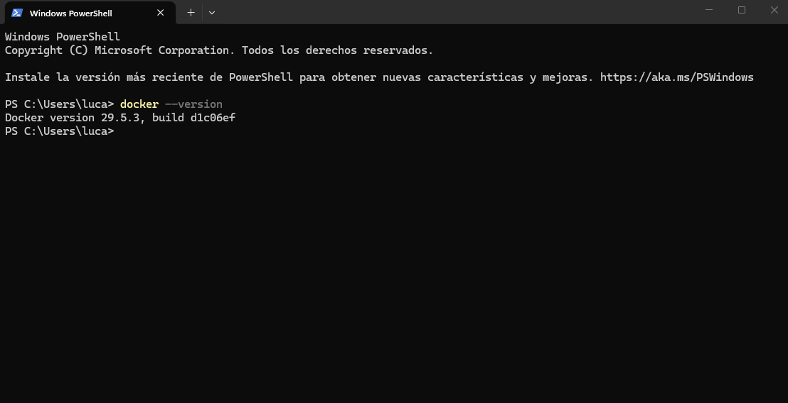
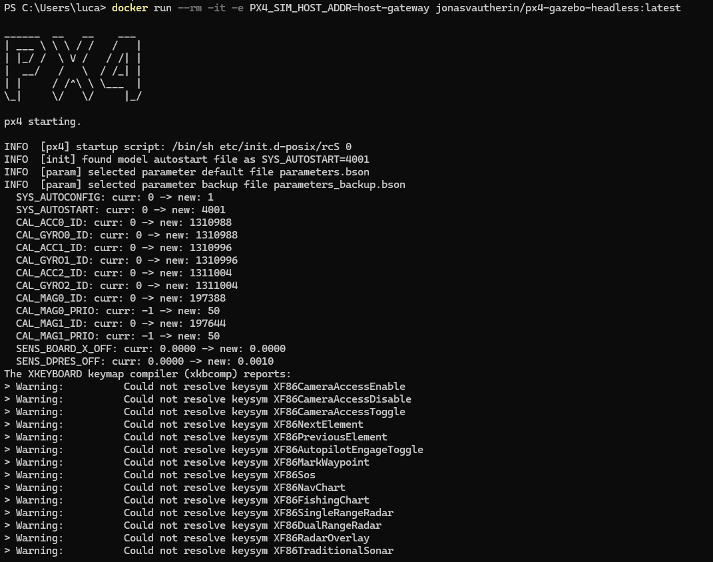
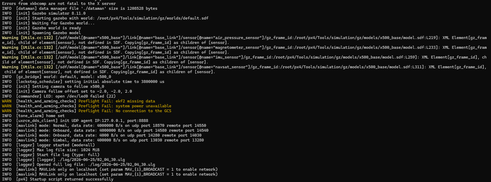

# Simulador PX4 en Windows con Docker + QGroundControl

Guía rápida para correr un dron simulado en Windows usando Docker, sin necesidad de Linux ni VMs.

## Requisitos

- Windows 10 o Windows 11
- [Docker Desktop](https://www.docker.com/products/docker-desktop)
- [QGroundControl](https://docs.qgroundcontrol.com/master/en/qgc-user-guide/getting_started/download_and_install.html)

## Instalación

### 1. Instalar Docker Desktop

Descargalo e instalalo. Durante la instalación activá **"Use WSL 2 based engine"** si te lo pregunta.

Verificá que funciona:

```bash
docker --version
```



### 2. Correr el simulador

```bash
docker run --rm -it -e PX4_SIM_HOST_ADDR=host-gateway jonasvautherin/px4-gazebo-headless:latest
```




### 3. Abrir QGroundControl

Abrilo y esperá. El dron debería aparecer solo en el mapa (conecta automáticamente por UDP 14550).


## Parámetros útiles para el simulador

| Parámetro      | Ejemplo                         | Para qué sirve             |
| -------------- | ------------------------------- | -------------------------- |
| `PX4_HOME_LAT` | `-34.6037`                      | Latitud inicial del dron   |
| `PX4_HOME_LON` | `-58.3816`                      | Longitud inicial del dron  |
| `PX4_HOME_ALT` | `10`                            | Altitud inicial en metros  |
| `VEHICLE`      | `iris` / `plane` / `tailsitter` | Tipo de vehículo a simular |
| `WORLD`        | `baylands` / `warehouse`        | Entorno de Gazebo          |
| `HEADLESS`     | `1`                             | Fuerza modo sin interfaz   |

**iris** es el cuadricóptero por defecto. Es el más usado y el que mejor funciona para probar.

**plane** es avión de ala fija. Necesita velocidad para volar, no puede hacer hover.

**tailsitter** es híbrido entre avión y dron, despega vertical y luego se inclina para volar horizontal.

Ejemplo con ubicación en Buenos Aires:

```bash
docker run --rm -it \
  -e PX4_SIM_HOST_ADDR=host-gateway \
  -e PX4_HOME_LAT=-34.6037 \
  -e PX4_HOME_LON=-58.3816 \
  -e PX4_HOME_ALT=25 \
  -e VEHICLE=iris \
  jonasvautherin/px4-gazebo-headless:latest
```
